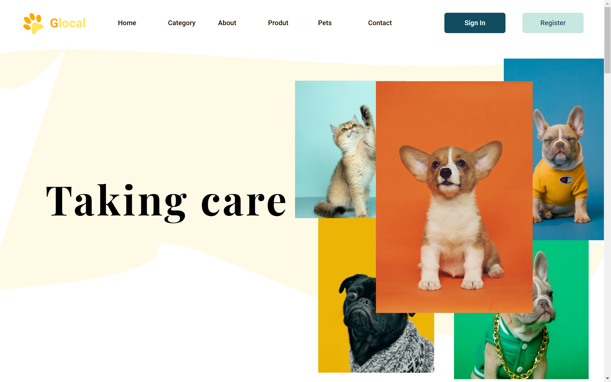

# Glocal ( The react app with GSAP and Scroll trigger )

The react website with GSAP and Scroll trigger for animation. This site was a frontend assingment for the interview round 1 in a company. This Site was developed in 2 Days.



### Live Project

For the better perspective You can compare the hosted project with figma file

- [Live link]()
- [Figma Design](https://www.figma.com/design/Ykvy7Ht926eIyLyT1S1LXF/Assignment-(Copy)?node-id=0-1&t=L3rcpWm7kyVpCcgl-1)

### Tech Stack

- GSAP 
- React JS
- Tailwind CSS
- Scroll trigger

### Features

- Scalable Code
- Loading Animation
- Scrolling Animation
- Standard Folder Structure
- latest useGSAP + Scroll Trigger

### To Run Project

clone the repo
```
    git clone 
```

run the project
```
    cd ./react-anime-site/
    npm i
    npm run dev
```

### Reference

- [Tutorial]()